# 项目简介

本项目是一个 **前后端分离** 的平台，旨在为学生提供 **服务器资源**、**实验结果保存** 以及 **数据可视化** 的功能支持。

# 主要功能

1. 首页

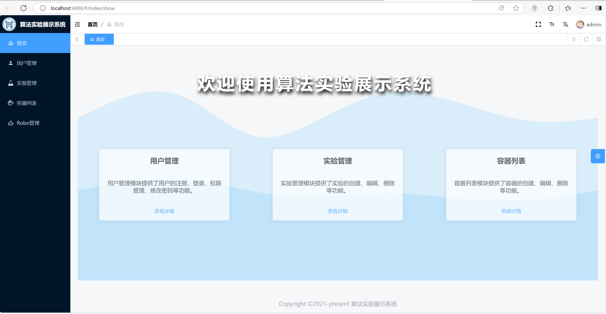

1. 用户管理（注册、登录、权限管理等）

用户登陆

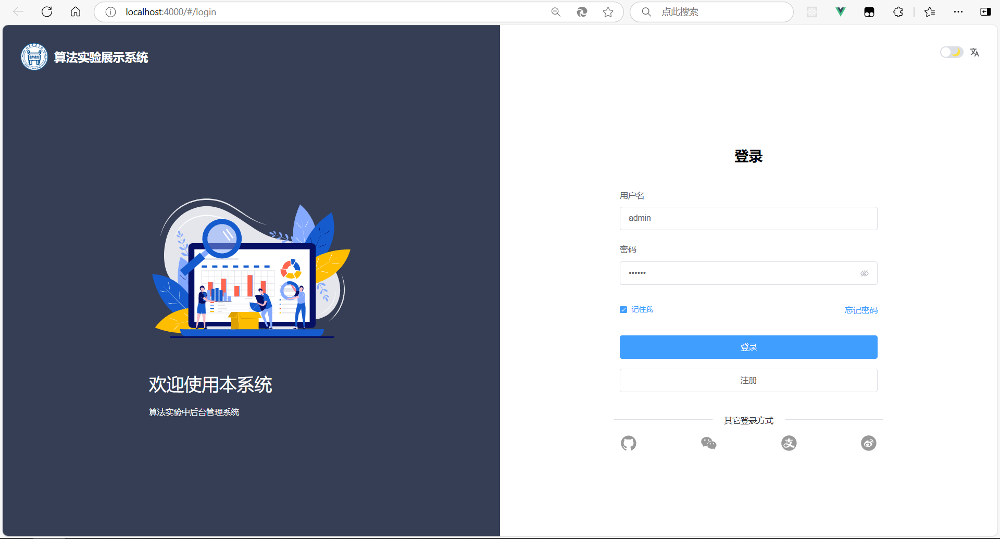

用户管理（管理员权限界面与学生权限界面）

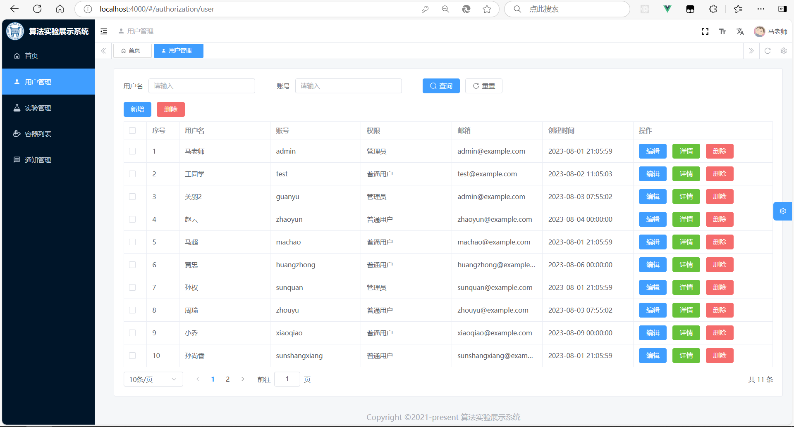

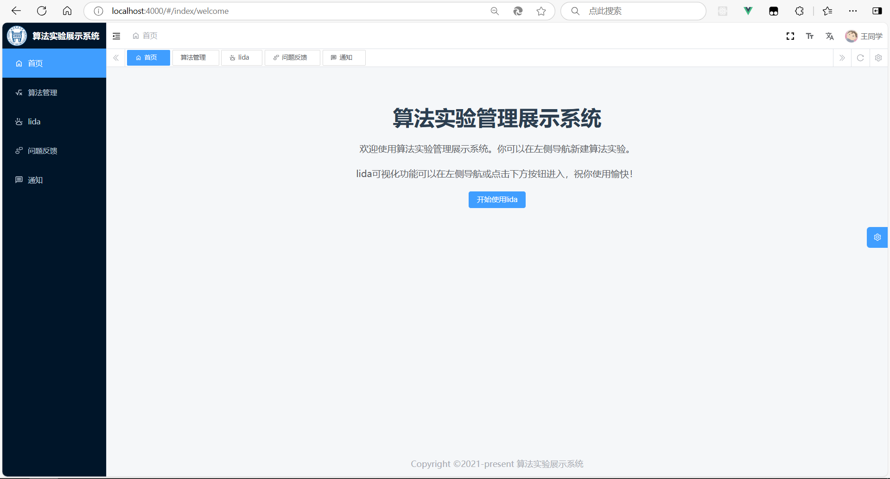

2. 实验管理

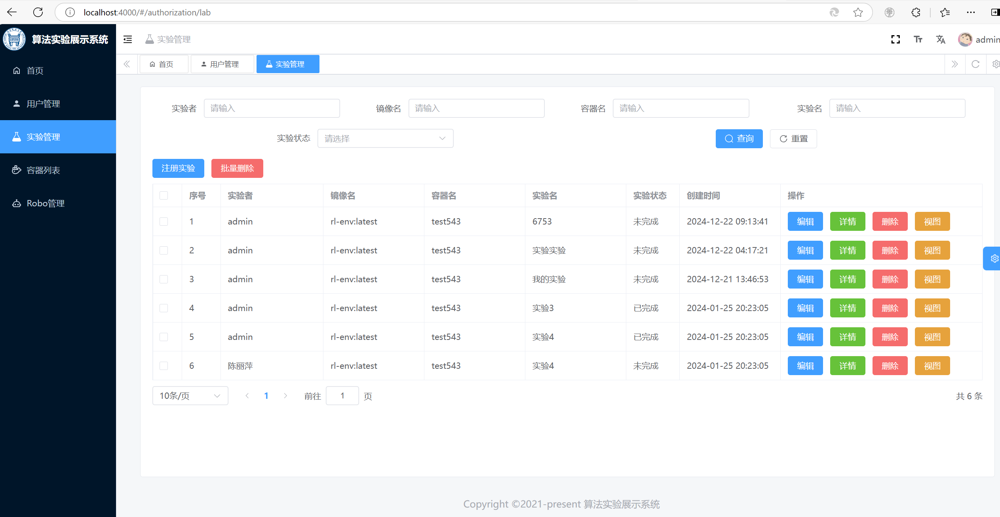

3. 数据展示与分析（统计图表）

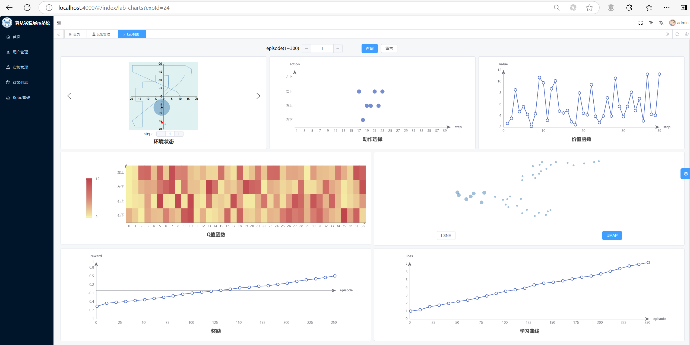

4. 容器管理与新增容器

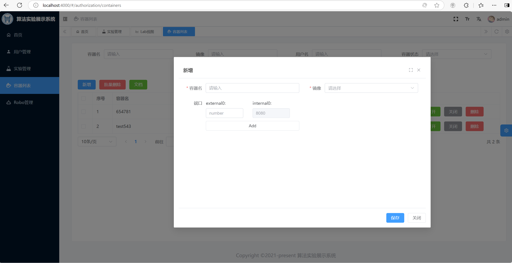

​	5.lida数据展示

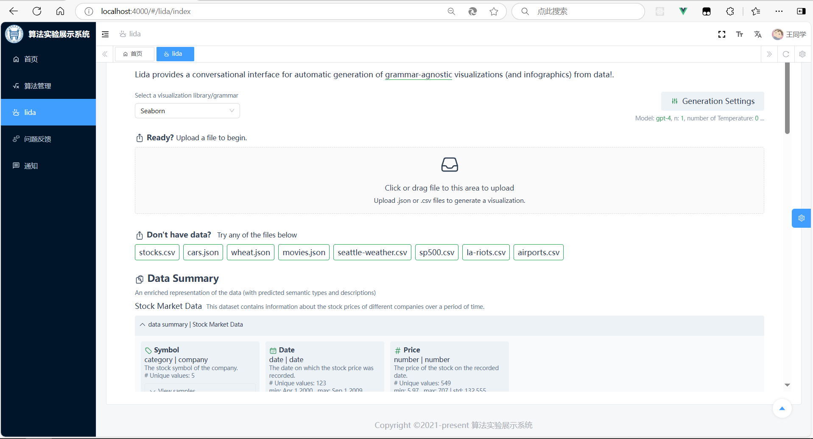

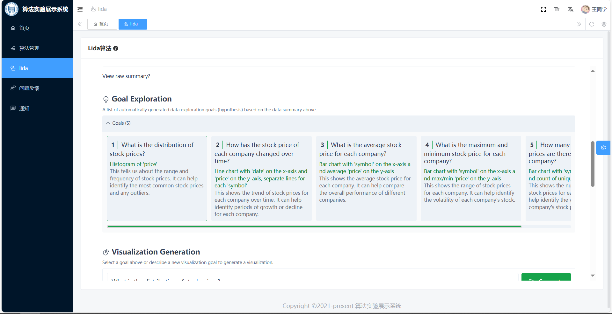

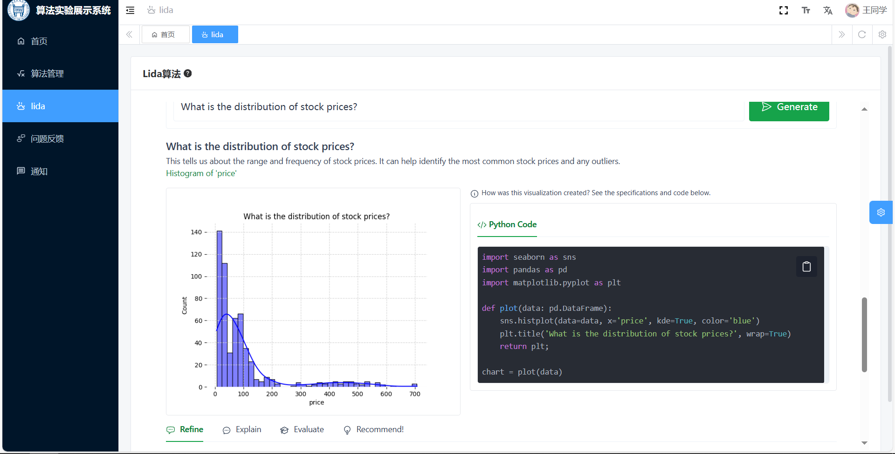

​	6.机器人管理

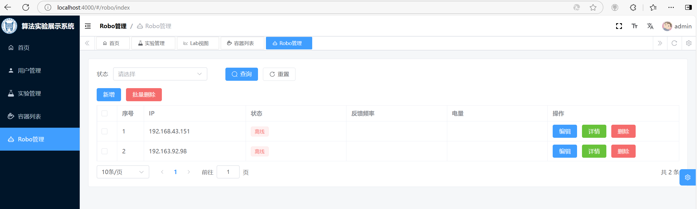

# 使用说明

先新增容器，连接服务器运行实验，再点击“视图”查看实验结果

# 安装与运行

## 1、部署完成版本使用

项目已部署至线上环境，用户可直接访问以下链接：

- **生产环境：** https://your-production-domain.com

- **测试环境：** https://your-staging-domain.com

- **默认账号：**（如适用，提供测试账号）

  - 管理员账号：

    ```
    用户名：admin@example.com  
    密码：admin123
    ```

  - 普通用户账号：

    ```
    用户名：user@example.com  
    密码：user123
    ```

## 2、本地开发环境运行

@zh @zyf 补充一下

**依赖要求：**

- Node.js >= 14.x
- pnpm >= 9.x.x
- python >= 3.9.x （tsne算法展示页面需要使用）
- Lida == 0.014
- 数据库：MySQL >= 8.0

**安装步骤：**

1. 克隆仓库：`git clone https://github.com/ustbmicl-visHMARL/vue-front1.git`
2. 安装依赖：`npm install --force`
3. 启动前端开发服务器：`pnpm run dev`
4. 启动lida：`lida ui --port=8088 --docs`
5. 启动t-SNE-UMAP服务器：`python /tsne-umap/run.py`
6. 访问地址：`http://localhost:4000`

# 技术栈

前端：

- [node](http://nodejs.org/) 和 [git](https://git-scm.com/) - 项目开发环境
- [Vite](https://vitejs.dev/) - 熟悉 vite 特性
- [Vue3](https://v3.vuejs.org/) - 熟悉 Vue 基础语法
- [TypeScript](https://www.typescriptlang.org/) - 熟悉 `TypeScript` 基本语法
- [Es6+](http://es6.ruanyifeng.com/) - 熟悉 es6 基本语法
- [Vue-Router-Next](https://next.router.vuejs.org/) - 熟悉 vue-router 基本使用
- [Element-Plus](https://element-plus.org/) - element-plus 基本使用
- [Mock.js](https://github.com/nuysoft/Mock) - mockjs 基本语法

后端：SpringBoot、Mybatis

数据库：Mysql

# 联系方式

- Email: [1837319971@qq.com](mailto:example@domain.com)