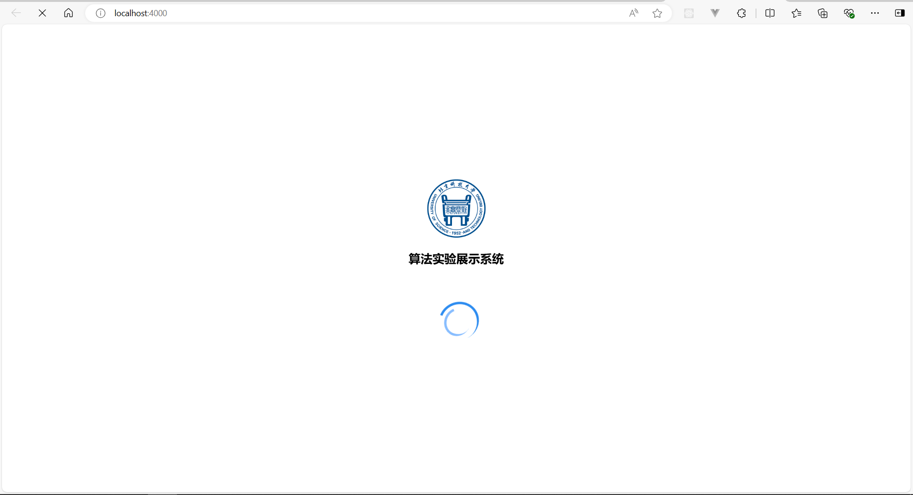
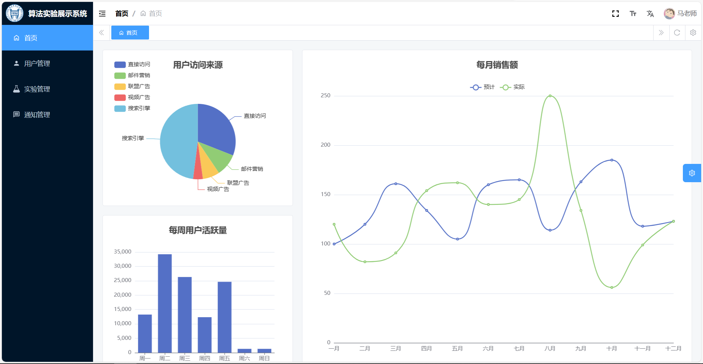
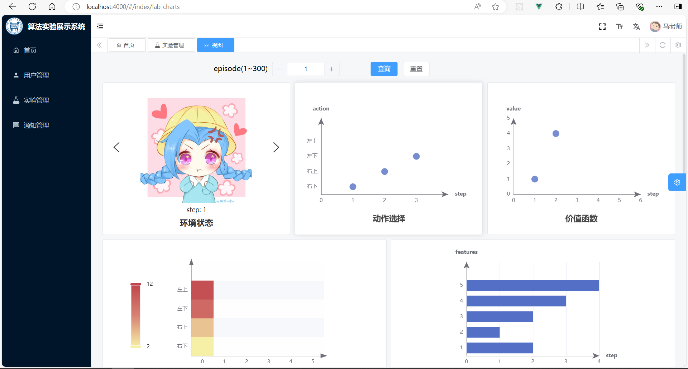

## 前序准备

- [node](http://nodejs.org/) 和 [git](https://git-scm.com/) - 项目开发环境
- [Vite](https://vitejs.dev/) - 熟悉 vite 特性
- [Vue3](https://v3.vuejs.org/) - 熟悉 Vue 基础语法
- [TypeScript](https://www.typescriptlang.org/) - 熟悉 `TypeScript` 基本语法
- [Es6+](http://es6.ruanyifeng.com/) - 熟悉 es6 基本语法
- [Vue-Router-Next](https://next.router.vuejs.org/) - 熟悉 vue-router 基本使用
- [Element-Plus](https://element-plus.org/) - element-plus 基本使用
- [Mock.js](https://github.com/nuysoft/Mock) - mockjs 基本语法

## 安装和使用

- 获取代码

```bash
git clone https://github.com/kailong321200875/vue-element-plus-admin.git
```

- 安装依赖

```bash
cd vue-element-plus-admin

pnpm install

```

- 运行

```bash
pnpm run dev
```

- 打包

```bash
pnpm run build:pro
```

## 预览效果







**Pull Request:**

1. Fork 代码
2. 创建自己的分支: `git checkout -b feat/xxxx`
3. 提交你的修改: `git commit -am 'feat(function): add xxxxx'`
4. 推送您的分支: `git push origin feat/xxxx`
5. 提交 `pull request`

## Git 贡献提交规范

- `feat` 新功能
- `fix` 修补 bug
- `docs` 文档
- `style` 格式、样式(不影响代码运行的变动)
- `refactor` 重构(即不是新增功能，也不是修改 BUG 的代码)
- `perf` 优化相关，比如提升性能、体验
- `test` 添加测试
- `build` 编译相关的修改，对项目构建或者依赖的改动
- `ci` 持续集成修改
- `chore` 构建过程或辅助工具的变动
- `revert` 回滚到上一个版本
- `workflow` 工作流改进
- `mod` 不确定分类的修改
- `wip` 开发中
- `types` 类型